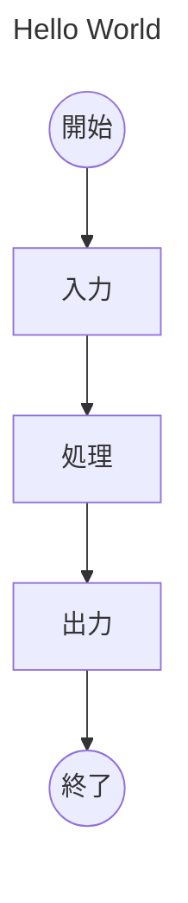
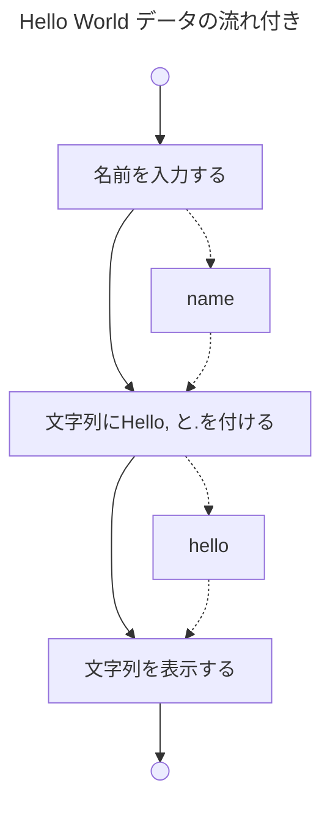
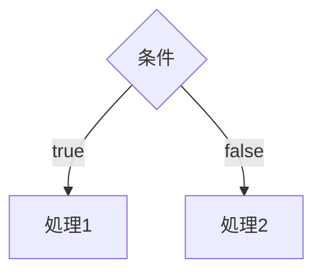
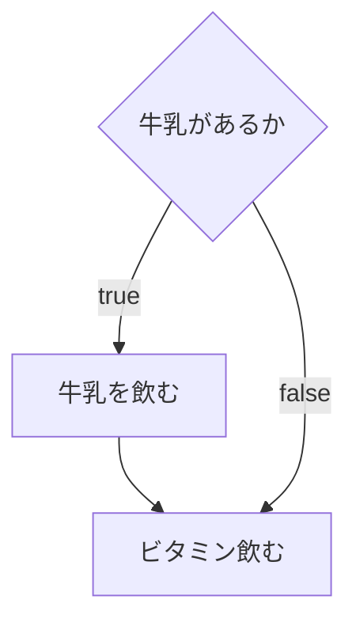
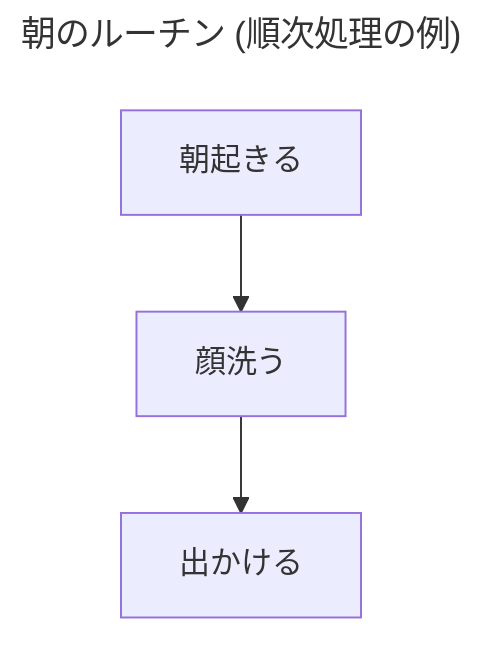
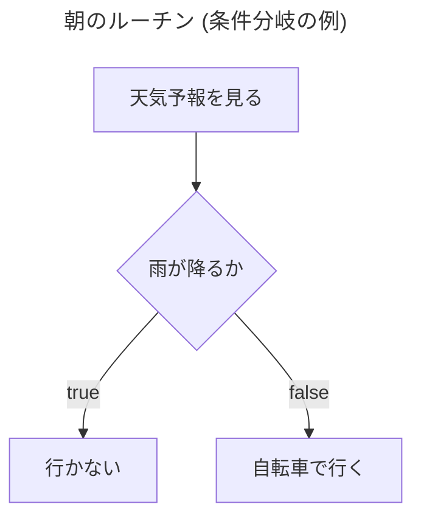
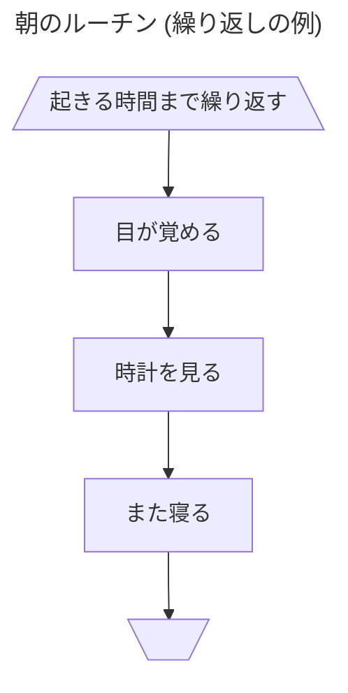

#フローチャートの例

mermaid記法の例にもなっています

```mermaid
---
title: Hello World
---
flowchart TB
    id0((開始))
    id1[入力]
    id2[処理]
    id3[出力]
    id4((終了))
    id0 --> id1 --> id2 --> id3 --> id4
```

```mermaid
---
title: Hello World データの流れ付き
---
flowchart TB
    START(( ))
    input[名前を入力する]
    process[文字列にHello, と.を付ける]
    output[文字列を表示する]
    END(( ))
    name[name]
    hello[hello]
    START --> input --> process --> output --> END
    input -.-> name -.-> process
    process -.-> hello -.-> output
```

```mermaid
flowchart TB
    id0{条件}
    id1[処理1]
    id2[処理2]
    id0 -- true --> id1
    id0 -- false --> id2
```

```mermaid
flowchart TB
    id0{牛乳があるか}
    id1[牛乳を飲む]
    id2[ビタミン飲む]
    id0 -- true --> id1 --> id2
    id0 -- false --> id2
```

```mermaid
---
title: 朝のルーチン (順次処理の例)
---
flowchart TB
    id1[朝起きる]
    id2[顔洗う]
    id3[出かける]
    id1 --> id2 --> id3
```

```mermaid
---
title: 朝のルーチン (条件分岐の例)
---
flowchart TB
    id0[天気予報を見る]
    id1{雨が降るか}
    id2[自転車で行く]
    id3[行かない]
    id0 --> id1
    id1 -- true --> id3
    id1 -- false --> id2
```

```mermaid
---
title: 朝のルーチン (繰り返しの例)
---
flowchart TB
    id0[/起きる時間まで繰り返す\]
    id1[目が覚める]
    id2[時計を見る]
    id3[また寝る]
    id4[\     /]
    id0 --> id1 --> id2 --> id3 --> id4
```

