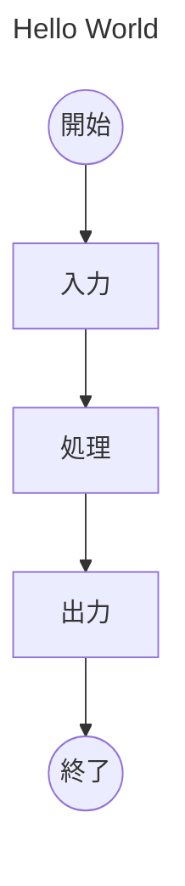
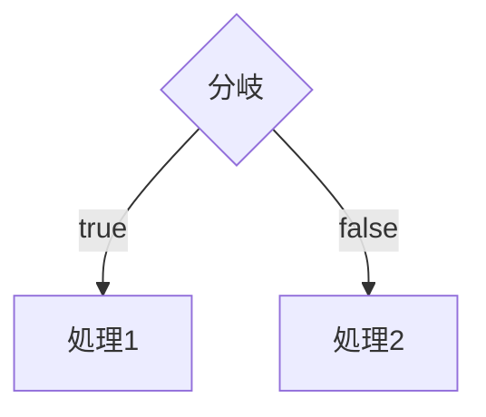

#フローチャートの例

mermaid記法の例にもなっています

```mermaid
---
title: Hello World
---
flowchart TB
    id0((開始))
    id1[入力]
    id2[処理]
    id3[出力]
    id4((終了))
    id0 --> id1 --> id2 --> id3 --> id4
```

```mermaid
flowchart TB
    id0{分岐}
    id1[処理1]
    id2[処理2]
    id0 -- true --> id1
    id0 -- false --> id2
```
